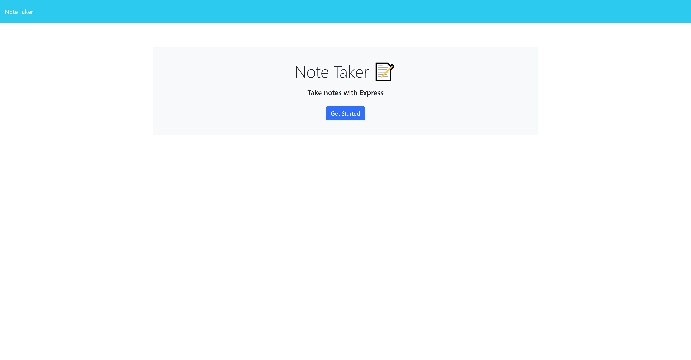
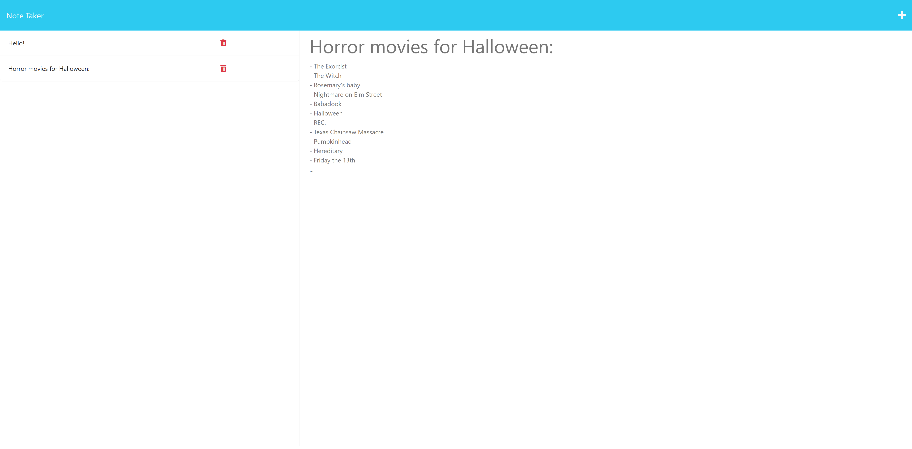

# Note-Tracker []
This is a Note Tracker that can be used to write and save notes.

## URL

https://note-tracker-aa.herokuapp.com/

## Table of Contents

- [Technologies](#technologies)
- [Usage](#usage)
- [License](#license)
- [Questions](#questions)

## Technologies

- HTML
- CSS
- Javascript
- Node.js
- Express.js
- uuid

## Usage

Press the Get Started Button -> Write a new note -> Save it with the Save button -> To delete press the delete button

## License

[]

## Questions

Github: <https://github.com/AndyAnza>
